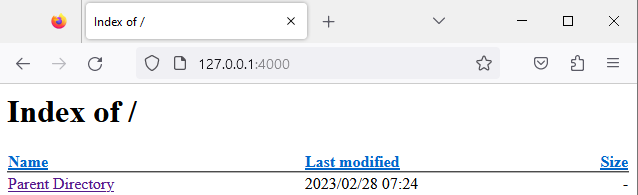
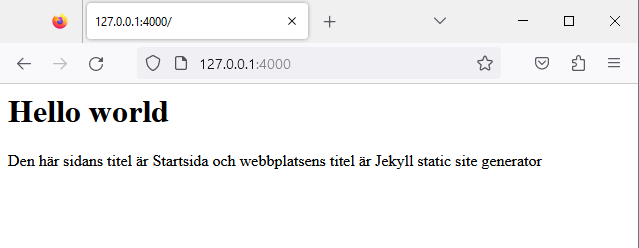
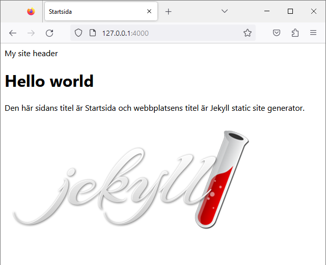

# GitHub Pages Jekyll

En guide i hur du använder Jekyll static site generator. 
Börja med att klona ner följande git repo [clone git repo Starefossen/docker-github-pages](https://github.com/Starefossen/docker-github-pages).

## Använd docker compose
För att starta applikationen skapar du en fil med namnet `docker-compose.yml`.

I filen anger du följande:

```yml
version: '3'
services:
  jekyll:
    image: starefossen/github-pages
    environment:
      - "JEKYLL_GITHUB_TOKEN:${JEKYLL_GITHUB_TOKEN}"
    ports:
      - "4000:4000"
    volumes:
      - ./:/usr/src/app
    tty: true
```

I terminalen kan du nu starta applikationen med kommandot 

`docker-compose up`

Applikationen startar och du kommer att se att webbläsaren lyssnar på port 4000, och en lista över mappar och filer i projektet.   



## Skapa en konfigurationfil
[https://jekyllrb.com/docs/configuration/default/](https://jekyllrb.com/docs/configuration/default/)

I Jekyll används en fil för att ange grundläggande inställningar för hur Jekyll ska hantera webbplatsen.  Skapa en fil med namnet `_config.yml` i root katalogen.

I filen anger du följande:

```md
title: En webbplats
markdown: kramdown

gems:
- jekyll-github-metadata
- jekyll-mentions
- jekyll-redirect-from
- jekyll-sitemap
- jemoji
```

## Skapa startsidan för webbplatsen

En statisk sidgenerator som Jekyll kan använda html filer och markdown filer. Skapa filen `index.md`, och ange följande innehåll.

```md
---
title: Min webbplats
---

# Hello world
Den här sidans titel är {{page.title}} och webbplatsens titel är {{site.title}}
```


I koden ovan kallas det som anges mellan trippla bindestreck för *YAML front matter block*. Ett block som måste deklareras överst i en fil. Det som anges innanför blocket tillhör den globala variabeln `page`. 

I Docker kan du använda kortkommandot `ctrl+c` för att stänga ner applikationen. Starta därefter upp den med `docker-compose up`. Applikationen har också en automatisk funktion för att starta om när en fil förändras.

Variabler som anges i Jekyll processas i generatorn och variablers värden (`page.title`) (`site.title`) blir synliga. Du kan själv ange fler variabler som ska finnas i applikationen. Till en sida kan du använda en variabel som `page.author` om den deklareras innanför kodblocket:



```markdown
---
title: Min webbplats
author: Flisa
---
```

I Jekyll hanteras olika variabler. Det finns globala variabler som har med hela webbplatsen att göra `site, page, layout, theme. content, paginator`.

Respektive global variabel har olika värden. För att visa aktuell tid finns exempelvis `site.time`. Se [lista över variabler: https://jekyllrb.com/docs/variables/](https://jekyllrb.com/docs/variables/)
  
I filen `_config.yml` kan egna variabler kopplas till den globala variabeln `site` - se i exemplet ovan: `site.title`.

---


## Inkludera filer
I Jekyll kan filer inkluderas, ex för att ange header och footer som ska visas på olika sidor. För att inkludera en fil ska den finnas i en katalog med namnet `_includes`.

Skapa mappen `_includes` och skapa därefter ett header element med namnet `header.html`. 

I filer `header.html` lägger du till ett header element.

```html
<header>
    Webbplatsens identitet
</header>
```

Därefter kan filen inkluderas på webbplatsens startsida genom att ange `` 

```markdown
---
title: Startsida
---



# Hello world
Den här sidans titel är {{page.title}} och webbplatsens titel är {{site.title}}

```

## Använd en layout mall
Sidor som ska ha ett gemensamt utseende kan också formges utifrån färdiga layout mallar. För att använda en mall ska den finnas i en katalog med namnet `_layouts`.

Skapa katalogen `_layouts` och lägg till en fil med ett passande filnamn, exempelvis `default`.

I filen `default` anger du sidans grundläggande struktur. För att visa det innehåll som finns på den sida som använder mallen anges `{{ content }}`.

```html
<!DOCTYPE html>
<html lang="sv">
<head>
    <meta charset="UTF-8">
    <meta http-equiv="X-UA-Compatible" content="IE=edge">
    <meta name="viewport" content="width=device-width, initial-scale=1.0">
    <title>{{ page.title }}</title>
</head>
<body>

    {{ content }}
    
</body>
</html>
```

Ange därefter vilken layout som ska användas för sidan i *YAML front matter blocket* genom att lägga till `layout: default`.


```markdown
---
title: Startsida
layout: default
---



# Hello world
Den här sidans titel är {{page.title}} och webbplatsens titel är {{site.title}}.

```

Beroende på hur layout ska förändras på olika sidor kan du välja i vilken fil som exempelvis ett *header* eller *footer* element ska inkluderas. I layoutmallen `default.html` eller på sidan `index.md`.


## Inkludera statiska filer
Mappen `assets` används för att inkludera olika filer som ska länkas in eller visas på sidan, exempelvis stilmallar eller bilder.

En lämplig struktur i mappen `assets` kan se ut så här:


```md

├── assets
├── css
│   ├── style.css
├── images
│   ├── picture.png

```

Länka in css filen i layoutmallen `default.html`

```html

    <title>{{ page.title }}</title>
    <link rel="stylesheet" href="/assets/css/style.css">

```

Lägg till bilden i layoumallen (alternativt på startsidan eller i en inkluderad fil)

```html

<body>

    {{ content }}
    
    

</body>

```

